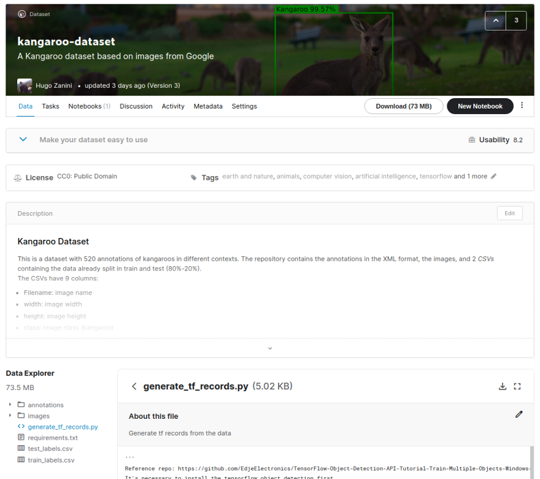
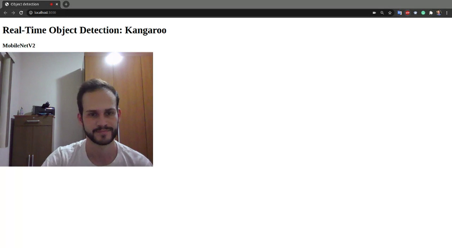

# Real-time object detection in the browser using TensorFlow.js

This repository is part of the tutorial [Custom real-time object detection in the browser using TensorFlow.js](https://blog.tensorflow.org/2021/01/custom-object-detection-in-browser.html). **For a better understanding of how to create a custom object detection model, refer to the post**.


This project is a simple web-app that loads a model in the TensorFlow.js layers format using javascript and performs real-time inferences ingesting videos from a PC or mobile camera.

A Kangaroo detector was trained as a demo, but any object can be recognized following the [tutorial steps](https://medium.com/@zaninihugo/custom-real-time-object-detection-in-the-browser-using-tensorflow-js-5ca90538eace) and it will produce results similar to the shown below:


<br>


<body> A live demo is available on Glitch:<br>  <a  href="https://glitch.com/edit/#!/real-time-object-detection">

</a>
</body
<br>


## Getting started

The model saved at `models/kangaroo-detector` was trained using the [kangaroo-dataset](https://www.kaggle.com/hugozanini1/kangaroodataset) available on kaggle:

<body> <a  href="https://www.kaggle.com/hugozanini1/kangaroodataset">

</a>
</body
<br>


You can train your own model, upload it in the `model` folder and load as well.

#### Serving the model

To make the model available, it is necessary to define how the model is going to be loaded in the function `load_model` (lines 10–15 in the file `src>index.js`). There are two choices.

The first option is to create an _HTTP server_ locally that will make the model available in a URL allowing requests and be treated as a REST API. When loading the model, _TensorFlow.js_ will do the following requests:

```
GET /model.json
GET /group1-shard1of5.bin
GET /group1-shard2of5.bin
GET /group1-shard3of5.bin
GET /group1-shardo4f5.bin
GET /group1-shardo5f5.bin
```

If you choose this option, define the `load_model` function as follows:


```js
async function load_model() {
	// It's possible to load the model locally or from a repo
	const model = await loadGraphModel("http://127.0.0.1:8080/model.json");
	//const model = await loadGraphModel("https://raw.githubusercontent.com/hugozanini/TFJS-object-detection/master/models/kangaroo-detector/model.json");
	return model;
}
```
Then install the [http-server](https://www.npmjs.com/package/http-server):

```
npm install http-server -g
```

Go to `models > kangaroo-detector` and run the command below to make the model available at `http://127.0.0.1:8080` . This a good choice when you want to keep the model weights in a safe place and control who can request inferences to it.

```
http-server -c1 --cors .
```
The second option is to upload the model files somewhere, in my case, I chose my own Github repo and referenced to the `model.json` URL in the `load_model` function:
homepage.png
```js
async function load_model() {
	// It's possible to load the model locally or from a repo
	//const model = await loadGraphModel("http://127.0.0.1:8080/model.json");
	const model = await loadGraphModel("https://raw.githubusercontent.com/hugozanini/TFJS-object-detection/master/models/kangaroo-detector/model.json");
	return model;
}
```

This is a good option because it gives more flexibility to the application and makes it easier to run on some platform as [Glitch](https://glitch.com/).

#### Running locally
To run the app locally, install the required packages:

```
npm install
```

And start:

```
npm start
```

The application is going to run at `[http://localhost:3000](http://localhost:3000)` and you should see something similar to this:



The model takes from 1 to 2 seconds to load and, after that, you can show the objects images to the camera and the application is going to draw bounding boxes around them.

